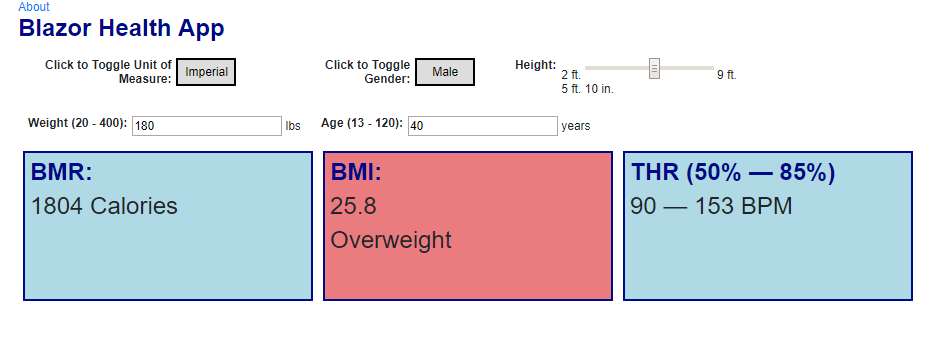

# Blazor Health App

[Angular 2 Health App](https://github.com/JeremyLikness/Angular2HealthApp) ported to [Blazor](https://jlik.me/gkz) `3.2.0-preview1.20073.1` to learn how Blazor works.

 Get your [Free Azure Account](https://jlik.me/gmk)

👀 See the running app [here](https://blazorhealthapp.z5.web.core.windows.net/)

Read the full blog post: [From Angular to Blazor: The Health App](https://jlik.me/ewt)

1. Navigate to the parent folder you would like to put the project in.
2. `git clone https://github.com/JeremyLikness/BlazorHealthApp.git`
3. Open the `BlazorHealthApp.sln` in Visual Studio 2017 or later
4. Compile/launch

[@JeremyLikness](https://twitter.com/JeremyLikness)
